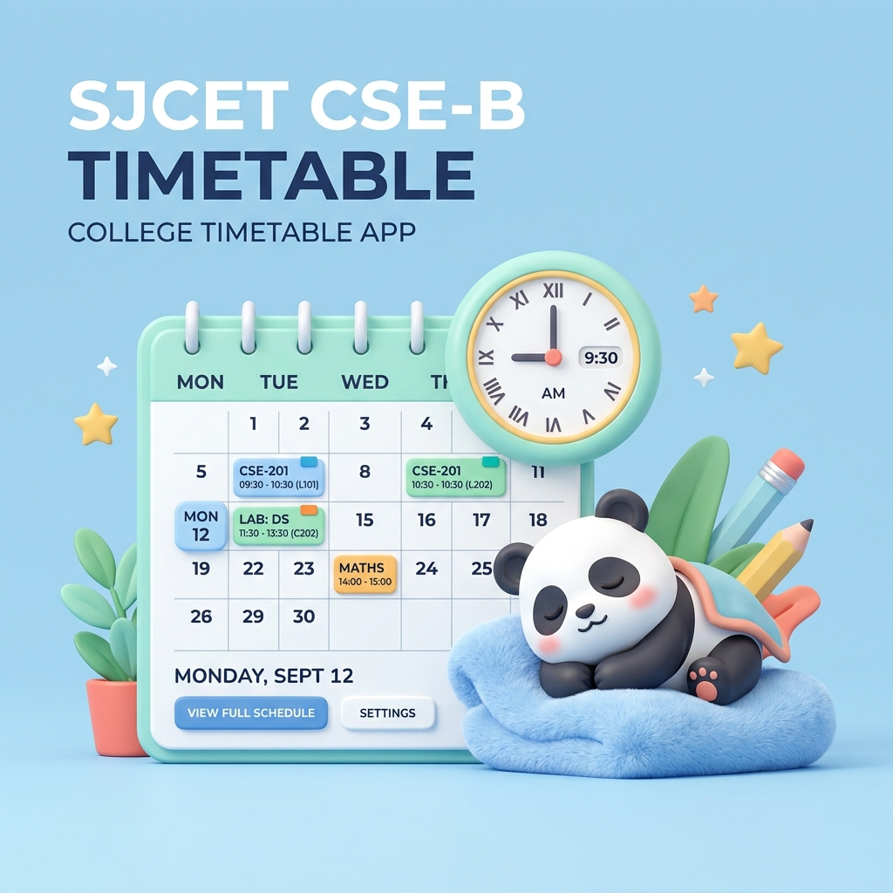

<div align="center">

# 🏫 SJCET CSE-B Timetable 📅✨

  <a href="https://ini-enthada-class.vercel.app/">
    
  </a>

  <p align="center">
    
    
    
  </p>

  <h4>A super-cute, calm, and mobile-first timetable app designed for SJCET CSE-B classmates! Know exactly what class is happening, what's next, and when the bell will ring! 🧸✨</h4>

  <p align="center">
    <a href="https://ini-enthada-class.vercel.app/"><b>✨ Visit Live App ✨</b></a>
  </p>

---

</div>

## 🌟 Key Features

* **🕰️ Live Bell Countdown**: Dedicated countdown page showing exactly how much time is left until the next class or break starts/ends.
* **🧸 Sleepy-Hours support**: The countdown works 24/7, showing remaining hours overnight and during weekends so you are never lost!
* **📅 Week's Flow**: View the entire week's schedule cleanly with dynamic filters.
* **⚡ Live Bento Cards**: Responsive bento-grid displaying:
  * Current class subject details.
  * Next upcoming class period.
  * Interactive progress bar.
  * **🦦 Vibe Check** indicator showing how deep you are into the current class!
* **⚙️ App Preferences**: A simple settings page to customize appearance and toggle class reminder preferences.

---

## 🎨 Cute Dashboard Indicators (Vibe Check)

Depending on your progress during a class, the app will update its status with cute animal highlights:

| Progress | Vibe Name | Emoji | Meaning |
| :--- | :--- | :---: | :--- |
| **0% – 25%** | Warmup | 🐣 | Class just started. Let's get ready! |
| **25% – 60%** | Cruising | 🦦 | Halfway through the lecture. Keeping it smooth. |
| **60% – 90%** | Cooking | 🚀 | Almost there, stay focused! |
| **90% – 100%** | Freedom | 🎉 | Nearly done. Packing bags! |

---

## 🛠️ Technology Stack

<p align="left">
  
  
  
  
  
</p>

---

## 🚀 Getting Started

To run the project locally on your machine:

1. **Clone the repository**
   ```bash
   git clone https://github.com/alwinjosegeorge/SJCET-CSE-B.git
   cd SJCET-CSE-B
   ```

2. **Install dependencies**
   ```bash
   npm install
   ```

3. **Start the development server**
   ```bash
   npm run dev
   ```
   Open [http://localhost:5173](http://localhost:5173) in your browser! 🎈

---

<div align="center">
  <h3>Made with 💖 for SJCET CSE-B</h3>
  <p>🧸✨ Keep cruising, superstars! ✨🧸</p>
</div>
